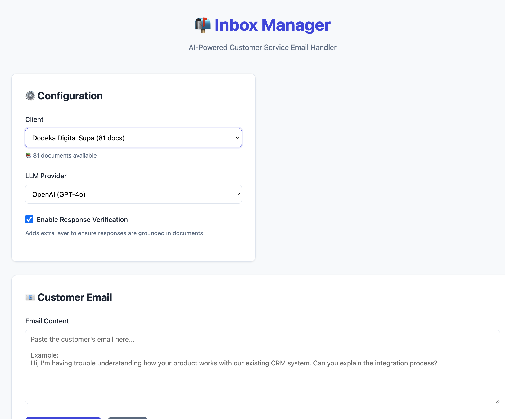

# PROJECT OVERVIEW

RAG setup for an agentic automation framework involved with inbox management and copywriting (client/prospect-facing). 

Context control is achieved by agents with a tight-scope knowledge bases (separated by client, by role) keeps output quality high enough to maintain customer satisfaction. Hallucinations are mitigated by using a vector db with a strict schema on the inputs. 

Future: try a semantic chunking strategy before embedding our files to the db

# PRIMARY WORKFLOWS

## 1. KNOWLEDGE BASE (VECTOR DB) CREATION + DATA INGESTION

  * Scraping, cleaning, formatting different data types from 1) client website 2) client intake form 3) client materials (google drive folder)
  * LLM-powered file categprization and meta data structure definition for each file to improve
  * Upsert new client data into vector db. DB architecture setup for safe/relaible context switching between 100+ client kb's 
  * Chunking and embedding (open AI embeddings, supabase db)
  * Query / retreival mechanism that leverages categorization fields >> improve quality and speed
  

## 2. CLIENT MARKETING BRIEF CREATION / AUTPOMATION

Agents write, format, and publish the client marketing brief which is what our MS team uses to download new clients.  The sections of the brief are broken down below. Everything is well-cited with links back to the source for verification.


### **Case study compilation + quality assessment**
  * Each case study is parsed into "target market", "service sold", "quantiative result", "how"
  * Case studies are stack ranked based on a scoring system for quality / spicyness

### **Client intake form summary**
  * extracts "services", "target markets", "case studies", "differentiatiors", "offers"  


### **Client's Drive folder summary**
  * Extract, categorize, summarize everything in their drive folder
        * .ppt, .slides, .doc, .google docs, .pdf, images, .csv, .xlsx >> nightmore to deal with 
        * GPT image analysis used to extract info from image-heavy pdf and powerpoints


### **Client's website summary**
  * Full sitemap scrape with LLM-assisted page categorization for client's knowledge base
  * Used to list all mentioned services and target markets for that client + used for client overview sections


### **NEW: Unique mechanism research**
  * Agent takes 5 of the services from the sources mentioned above, does deep search on "advanced strategies for [x] in 2025" and summarizes the results for the MSs to plug into their work when they need a mix up


## CODE EXAMPLES

### Full onboarding workflow (add  client to knowledge base + generate marketing brief)

```bash
# interactive mode: you will be prompred for client_id, drive_folder_id, and client_homepage_url
python agentic_workflow.py
```

```bash
# not interactive mode: just runs...
python agentic_workflow.py --client-id slice-communications --drive-folder-id 191aog58jGQDC6nzvQErM4cq5urqwB1F0 --client-homepage-url https://mintleads.io --workers 8 --batch-mode
```

### Full onboarding workflow for everyone in your "queue,md" file
```bash
python run_client_queue.py --queue-file client_onboarding_queue.md --max-concurrent 2

# client_onboarding_queue.md: 

# [client_id, drive_folder_id, website_url]

[ubiq-education, 1J-PTkl51J0UKB9F0DMFpuHiPyGOkWacs, https://www.ubiqeducation.com/]
[f1-cloud-solutions, 1AqLTL1fnYHs0iRuQQujKi8JdDdIDz5Lg, https://www.f1cloud.com]
```

### Add new client to the knowledge base - no brief generation

```bash
python supabase_client_ingestion.py --client-id mintleads --drive-folder-id 191aog58jGQDC6nzvQErM4cq5urqwB1F0 --client-homepage-url https://mintleads.io

```
### Generate client's marketing brief file from their knowledge base

```bash

python supabase_brief_generator.py --client-id mintleads
```
#### ONLY Chunking/embedding/uploading a client's client_brief file

Happens pretty often for client_brief files since those are inherently generated after we've ingested everythign to the db already

```bash

python inbox_manager/chunk_single_client.py CLIENT-ID

```

# 3. CHAT BOT TO HANDLE CLIENT'S WARM LEADS / EMAILS 

* Flask app interface with a chatbot connected to the vector db
* Easy toggling between client knowledge bases
* Verification and relevance agents double check the replies drafted by the handler agent
* Email_handler needs more training on how to sell the call when there's not an obvious fit

## CODE

```bash
cd inbox_manager
python app.py

# then you can click on the local host and interface with the chatbot
```

<br>



<br>

## Improvement Opps: 

  * **Add an agent that takes body of the email, finds the prospect's website, and gives the intel to the email_handler to personalize responses**  
  * Would be good to figure out sessions / memory and have that persist for a given client  

<br>
<br>

# THE END FOR NOW


<!-- ~~


### Common onboarding failure scenarious require you to have to pick up ingestion somewhere in the middle of the process: 

- python supabase_brief_generator.py --client-id pr-return --drive-folder-id 1_3jnBcFNkBgJx5BFFxxYhf0AKYIHlaW5 && python inbox_manager/chunk_single_client.py pr-return

### SQL queries to see onboarding status of everyone in the vec db:

```sql
-- Only problem state clients:
SELECT * FROM public.client_processing_status
WHERE processing_status <> 'fully_processed'
ORDER BY client_id;

-- 1) Clients in clients, no documents
SELECT * FROM public.client_processing_status WHERE processing_status = 'no_documents' ORDER BY client_id;

-- 2) Clients with documents but no chunks
SELECT * FROM public.client_processing_status WHERE processing_status = 'documents_no_chunks' ORDER BY client_id;

-- 3) Clients with docs + chunks but no client_briefs row
SELECT * FROM public.client_processing_status WHERE processing_status = 'docs_chunks_no_client_brief' ORDER BY client_id;

-- 4) Clients with docs + chunks + client_briefs, but no client_brief chunks
SELECT * FROM public.client_processing_status WHERE processing_status = 'missing_client_brief_chunks' ORDER BY client_id;
```
### 1) New client ingestion (Supabase)
- Use `supabase_client_ingestion.py` (interactive or batch) to scrape website + Drive and upload to Supabase.
- Upload-only (skip scraping, use existing outputs):
```bash
python supabase_client_ingestion.py --upload-only \
  --client-id "<CLIENT_ID>" \
  --output-dir ingestion/client_ingestion_outputs
```

### 2) Run steps individually (for recovery)
- Website ingestion: `ingestion/ingest_client_website.py`
- Drive ingestion: `ingestion/ingest_specific_drive_folder.py`
- Upload to Supabase only: `supabase_client_ingestion.py --upload-only ...`
- Generate brief: `supabase_brief_generator.py --client-id <CLIENT_ID>`
- Chunk brief for inbox manager: handled by `inbox_manager/vector_store.py` via the app

### 3) Inbox Manager app
- Uses `documents`, `document_chunks`, and `client_briefs` in Supabase.
- Documents are upserted via `(client_id, uri)`; chunks link to `documents.id`.
- Brief chunking uses `client_briefs` and writes `document_chunks` with `content_type='client_brief'`.

### Useful SQL
- Consolidated status: `public.client_processing_status`
```sql
SELECT * FROM public.client_processing_status ORDER BY client_id;
```

### Notes
- Environment: `SUPABASE_VECTOR_DB_CONN`, `OPENAI_API_KEY` must be set.
- Outputs live under `ingestion/client_ingestion_outputs/<CLIENT_ID>/`.
~~ -->